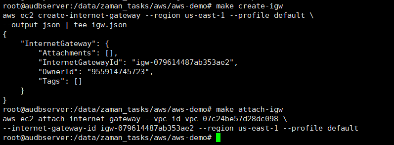

# AWS VPC, Subnet, and IGW Deployment via Makefile

AWS is Amazon's robust cloud computing platform offering a variety of on-demand services for storage, computing power, and more. In this article, we will **deploy VPC, Subnet, and IGW** in AWS from a Makefile. Let's first get familiar with the terminologies:

## Terminologies:

- **VPC (Virtual Private Cloud):** A VPC is a virtual network that you create within AWS, providing you with control over your AWS environment. It allows you to define a virtual network topology, including IP address ranges, subnets, routing tables, network gateways, and security settings. It enables you to launch AWS resources, such as EC2 instances or RDS databases, within a defined virtual network.

- **EC2 (Elastic Compute Cloud):** EC2 is a core service provided by Amazon Web Services (AWS) that offers resizable compute capacity in the cloud. An EC2 instance is a virtual server running in the AWS cloud, allowing users to rent virtual machines (VMs) to run applications.

- **Subnet:** A subnet is a segmented section of a VPC's IP address range. It divides the VPC's IP address range into smaller parts, allowing you to organize resources and control network traffic more effectively. Subnets are associated with specific availability zones within a region and can be public (accessible from the internet) or private (accessible only within the VPC or through a VPN connection).

- **IGW (Internet Gateway):** An IGW is an AWS component that allows communication between instances within a VPC and the internet. It enables internet access for resources in public subnets, facilitating inbound and outbound traffic to and from the internet.

- **Makefile:** Makefile is a script containing a set of directives used with the make build automation tool. It defines rules to execute tasks, specifying dependencies and commands for building software or performing other actions. It typically includes instructions for compiling code, managing files, running tests, and more, aiding in automating software development processes.

## Getting Started:

1. **AWS CLI Configuration:** Set up AWS CLI on your local machine for authentication. Refer to [AWS CLI installation guide](https://docs.aws.amazon.com/cli/latest/userguide/getting-started-install.html).

2. **Install jq:** Install jq on your local machine to read JSON files and extract parameters.

## Makefile Usage:

- **Running the Makefile:**
    1. Go to the Makefile directory.
    2. Run: `make create-vpc`.

- **Makefile Commands and Actions:**

    - **Step 1: Create VPC**
        - `make create-vpc`: Creates a VPC with a specified CIDR block in the designated region using AWS CLI. Outputs details to `vpc.json`.

        - `make create-tags-vpc`: Creates tags for the VPC using the VpcId stored in `vpc.json`.

    - **Step 2: Create Subnet**
        - `make retrieve-subnet-id`: Retrieves the SubnetId using the VpcId stored in the generated JSON file.

        - `make create-subnet`: Creates a subnet associated with the VPC using the specified CIDR block. Outputs details to `subnet.json`.

        - `make create-tags-subnet`: Creates tags for the subnet using the SubnetId.

    - **Step 3: Create IGW**
        - `make create-igw`: Creates an Internet Gateway (IGW) using AWS CLI and outputs details to `igw.json`.

        - `make attach-igw`: Attaches the IGW to the VPC using the respective IDs.

- **Visual Guide:**
    - Visual steps and outputs are provided with corresponding images in the directory.

