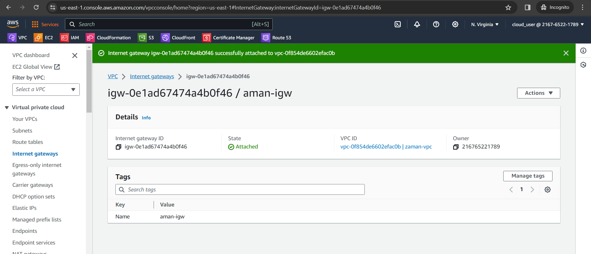

# NGINX L7 Load Balancer Configuration and Service Deployment

**Objective:**
Configuring an NGINX L7 Load Balancer using a single VM and deploying two services named `api.poridhi.io` and `fr.poridhi.io`.

**Steps:**

1. **Create VPC**

    

    _Description: Creating the VPC on AWS from dashboard_

2. **Create Subnet**

    

    

    _Description: Setting up the Subnet_

3. **Create Internet Gateway and Attach to the VPC**

    

    _Description: Establishing Internet Gateway_

4. **Add Route 0.0.0.0**

    

    

    


    _Description: Setting up Routes_

5. **Create EC2 Instance**

    

    

    _Description: Spinning Up an EC2 Instance_

6. **Install NGINX on EC2 Instance**

7. **Install Node.js**

8. **Create svc1 and svc2 App**
Need to repeat this for svc1 and svc2 app directory.
    ```
    sudo npm init
    npm i express
    node server.js
    ```

    

    _Description: Creating and Running svc1 and svc2 App_

9. **Configure NGINX**
    - nginx.conf file contains the configuration
    - Verify NGINX configuration:

        ```
        nginx -t -c /etc/nginx/nginx.conf
        ```

    - Reload NGINX:

        ```
        nginx -s reload
        ```

    - Edit host: `C:\Windows\System32\drivers\etc`

    

    _Description: Configuring NGINX for Load Balancing_
